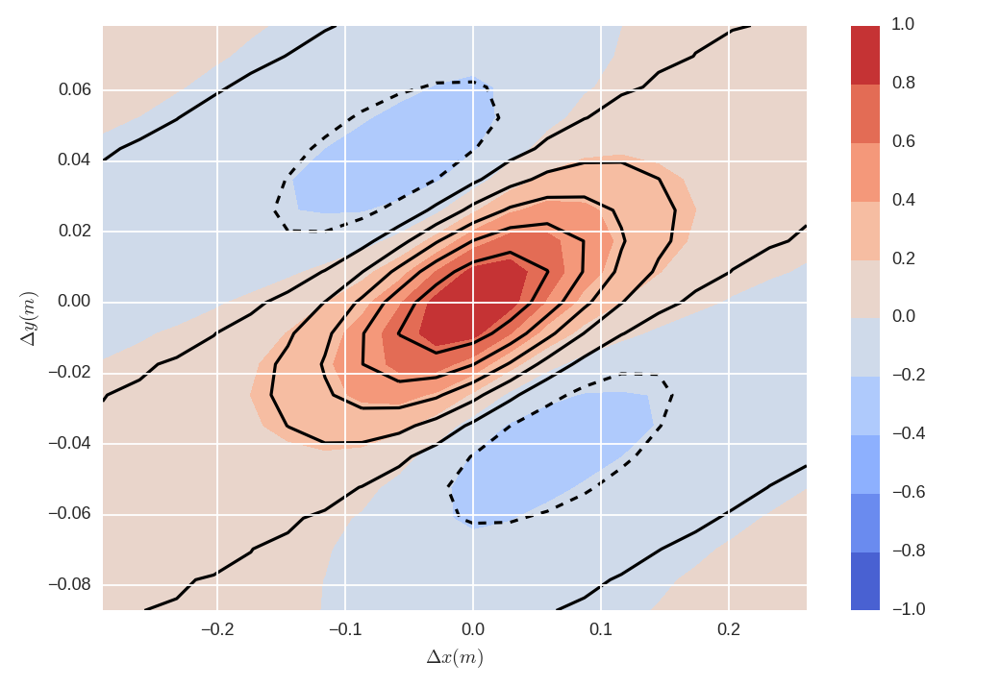
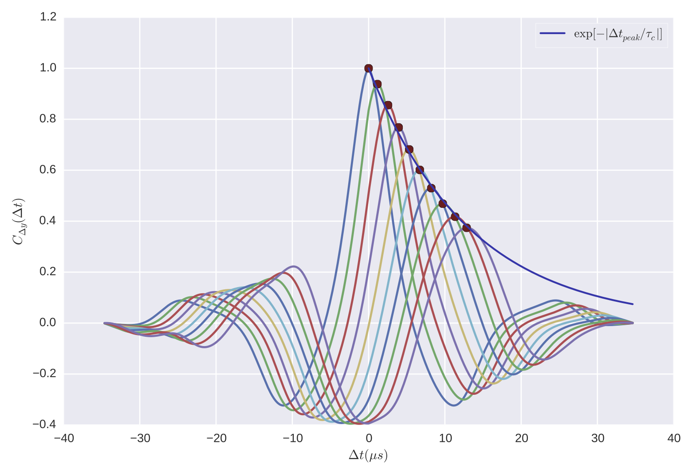

Analysis Overview
=================

This page describes the different analysis types that can be performed using
`gs2_correlation`, as well as additional useful features.

Middle vs. Full
---------------

`gs2_correlation` has two different analysis modes depending on the `size`
command line parameter: 'full' and 'middle'. Full analysis analyzes the whole
GS2 output domain and uses algorithms which take advantage of fact that field
is in Fourier space. 

'Middle' analysis was added to perform a correlation analysis on the middle of 
the GS2 domain. This process is more involved than it sounds since one cannot
take advantage of Fourier space properties anymore. Hence fields are converted
to real space first, only the middle part is extracted (with size determined by
a configuration variable), and the same plotting and fitting functions are used
as before (with minor variations).

To accommodate these two modes, separate classes were created, however the user
does not need to do anything besides specify whether they want to analyze the 
full or middle part of the domain (along with the box size in the case of 
'middle'). To find out more about the command line parameters, run the following
command:

.. code:: bash

   $ python gs2_correlation/main.py -h

This will show the various command line parameters as well as a short 
description and their expected positions.

Perpendicular Correlation
-------------------------

In GS2, fields are written out as a function of kx and ky. This allows the use
of the Wiener-Khinchin theorem in 2D to calculate the correlation function:

.. math:: C(\Delta x, \Delta y) = IFFT2[|f(k_x, k_y)|^2]

where C is the correlation function, *f* is the field, and IFFT2 is the 2D 
inverse Fourier transform. Briefly, the perpendicular correlation analysis
performs the following:

* Calculates the 2D correlation function using the WK theorem.
* Splits the correlation function into time windows (of length *time_slice*, 
  as specified in the configuration file).
* Time averages those windows and fits them with a tilted Gaussian to find the
  correlation parameters lx, ly, kx, ky, theta.
* Writes correlation parameters into a csv file, with one row per time window.
* Generates and saves various plots of the true and fitted correlation functions.

Time Correlation
----------------

Calculating the correlation time consists of two main parts:

* Calculating the time correlation function.
* Fitting the correlation function with an appropriate function to get the
  correlation time.

Time Correlation Function
^^^^^^^^^^^^^^^^^^^^^^^^^

The field is firstly converted to real space and saved as a new variable called
*field_real_space*. This leaves us with a field *f(t, x, y)*. In order to have 
some statistics about how the correlation time is changing over the course of
the simulation, we split the time domain into time slices, of size *time_slice*
defined in the configuration file. The correlation time may also depend on the
size of this time slice, so some tests should be done to ensure that this is 
understood.

For each time slice we want to calculate the correlation function *C(dt, x, dy)*, 
leaving us with a function *C(it, dt, x, dy)*, where *it* denotes the time slice
index. This is done by using the SciPy function, ``scipy.signal.fftconvolve``.
Noting that a convolution and a correlation calculation is related by a 
reversal of the indices of the second function.

Fitting
^^^^^^^

The fitting procedure is best illustrated by the following diagram.

The coloured lines are the correlation function for several different 
separations in *y*. The blue line is the decaying exponential fit to the peaks
of the correlation function, and the correlation time is the characteristic
time of the decaying exponential. Depending on the direction of flow, the 
peaks may be exponentially increasing or decreasing, and the appropriate 
function is fitted in either case. In regions where there is no flow, a Gaussian
function is fitted to the central, *dy* = 0, function and the correlation time
is taken to be the characteristic time of the exponential envelope.

The following options are relevant to the fitting procedure:

* npeaks_fit: determines the number of peaks to fit with a decaying exponential.
  Having too few or too many may cause the fitting procedure to fail.
* time_guess: This is the initial guess used in the fitting procedure in 
  normalized time units. Visual inspection can be used to verify the fitting
  procedure.

Create a Film
-------------

Films of the field varying in time is done as follows:

* Convert field to real space: *f(t, x, y)*.
* Determine max and min values of the field to keep the graph scale constant.
* Write out each frame of the film as png files.
* Use avconv to combine png files into a film at a rate of *film_fps* frames
  per second.

Zonal Flow Velocity
-------------------

The ZF velocity is calculatd by:

* Reading in the electrostatic potential at ky = 0.
* Calculating v_zf = Re(IFT[phi(ky=0)*kx])*nx. The *nx* term is necessary since
  the spectral->real conversion does not require any normalization but the 
  Numpy routines contain an explicit 1/n normalization to ensure IFT(A) = a.
* This gives v_zf(t,x) which can be plotted in 2D and averaged in time to give
  the mean ZF velocity as a function of radius.

